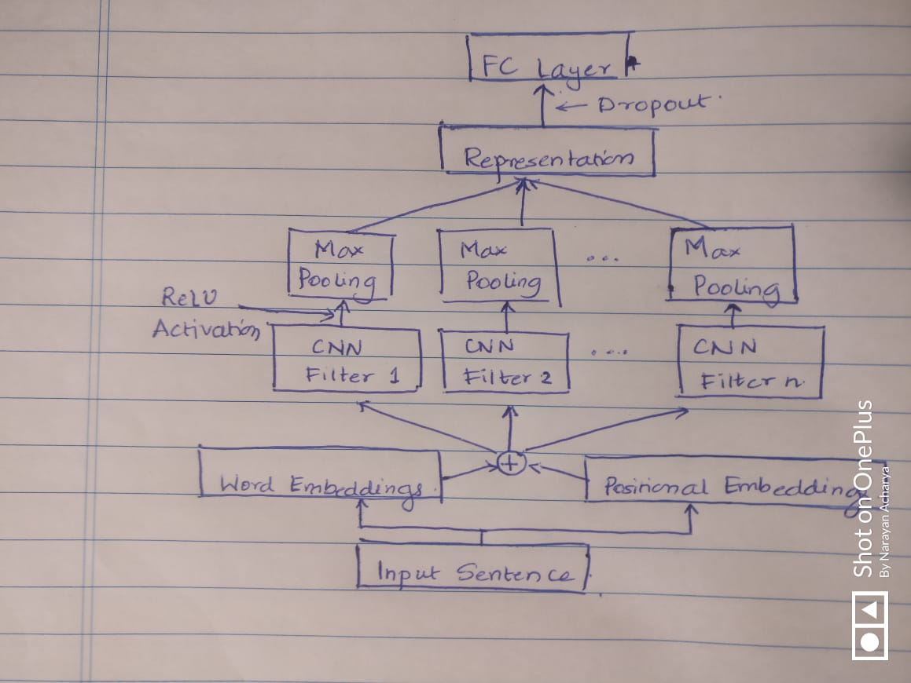

### BASIC MODEL:
---
Steps to run the basic model with word, pos and shortest path: [DEFAULT]

1. Use `shortest_path = find_shortest_path(doc, start, end)` in data.py [Check around line 71, Comment out line 74]
2. RUN: `python train_basic.py --embed-file data/glove.6B.100d.txt --embed-dim 100 --batch-size 10 --epochs 5`

For the experiments:
a. Only Word Embeddings:
1. Use `shortest_path = []` in data.py [Check around line 74, Comment out line 71]
2. Use `rnn_outputs = self.gru_layer(word_embed, mask=mask)` in model.py [Check around line 51, Comment out line 48]
3. RUN: `python train_basic.py --embed-file data/glove.6B.100d.txt --embed-dim 100 --batch-size 10 --epochs 5`

b. Only Word + PoS Embeddings:
1. Use `shortest_path = []` in data.py [Check around line 74, Comment out line 71]
2. Use `rnn_outputs = self.gru_layer(rnn_input, mask=mask)` in model.py [Check around line 48, Comment out line 51]
3. RUN: `python train_basic.py --embed-file data/glove.6B.100d.txt --embed-dim 100 --batch-size 10 --epochs 5`

c. Only Word + Shortest Path Dependency Structure:
1. Use `shortest_path = find_shortest_path(doc, start, end)` in data.py [Check around line 71, Comment out line 74]
2. Use `rnn_outputs = self.gru_layer(word_embed, mask=mask)` in model.py [Check around line 51, Comment out line 48]
3. RUN: `python train_basic.py --embed-file data/glove.6B.100d.txt --embed-dim 100 --batch-size 10 --epochs 5`

### ADVANCED MODEL:
---

For the advanced model, changes were made to `data.py` in order to gather positional features which are inputs to the 
advanced model.

Changes were also made to the `call` method of the basic model as the implementation for the basic and advanced model 
were tied at the `train_lib.py` file which requires inputs to the model be a certain way. 

Changes added had an impact on generating training and val instances due to the additional steps involved. It can be 
further improved 

Steps to run the advanced model:

1. Use `shortest_path = []` in data.py [Check around line 74, Comment out line 71]
2. RUN: `python train_advanced.py --embed-file data/glove.6B.300d.txt --embed-dim 300 --batch-size 20 --epochs 6`

---
Forward Prop of our Advanced Model:

1. The input to our advanced model is a concatenations of word embeddings with that positional embeddings.
Positional embeddings are essentially based on how close or far other words are to our entities in question.

2. The advanced model has one layer of convolutional filters of different sizes being applied to the input. We convolve
with filters of different sizes [2, 3, 4 and 5] with use ReLU as our activation function. To each of the results of the 
filters we apply Max Pooling using a filter of size according the size of the filter we convolved with.

3. Next we concat the outputs of each of our CNN filters that is (Conv, ReLU, MaxPool), flatten it out, add  then add 
dropout to address for over-fitting. This generates a sentence representation for us to use for classification into
our 19 classes for relationship.

